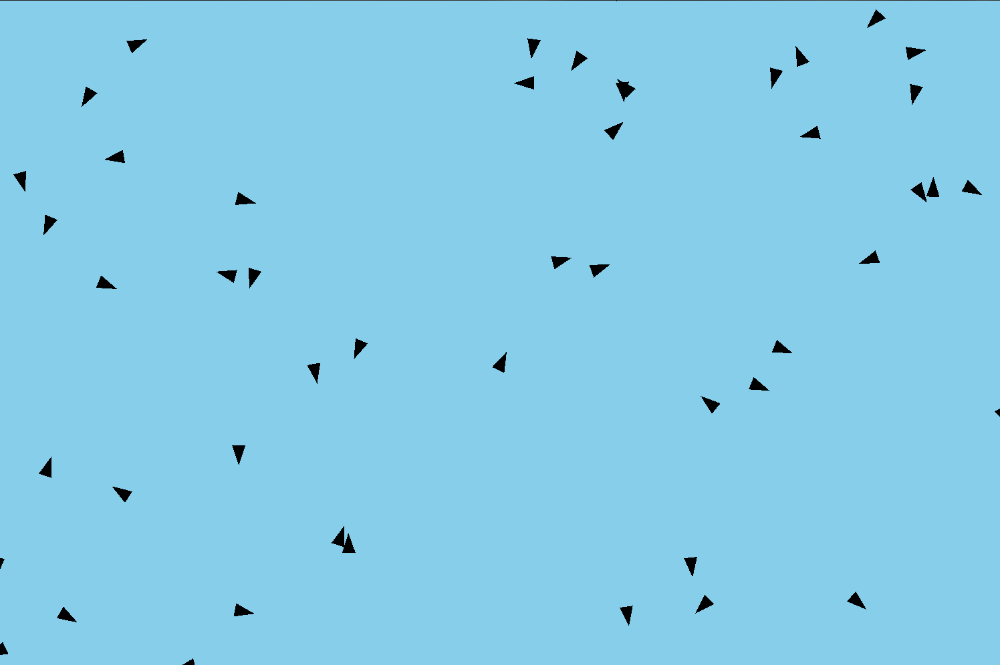
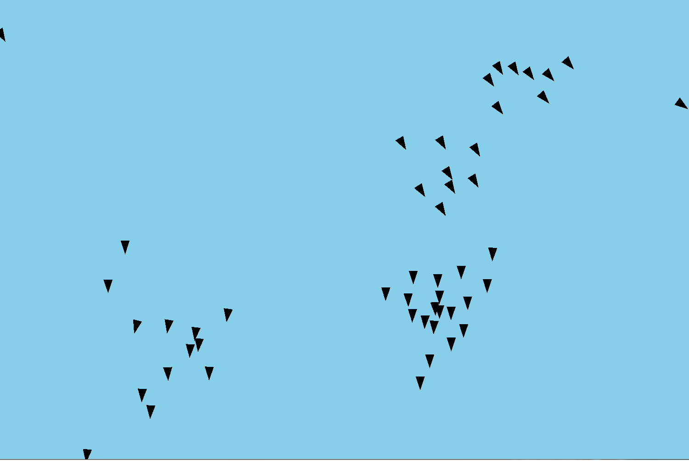

# Flocking_Simulator
2D Flocking Simulator 

Boids! Cellular automata! Simple rules! Cool patterns! Yaaay!

Implementation of Boids algorithm in C++

Boids algorithm: https://en.wikipedia.org/wiki/Boids

Run visualize.cpp to display flocking (requires SFML)

Boids at t=0:

Boids at t=n:

Beautiful results. Pretty interesting that fairly realistic behavior can emerge from 3 simple rules.
